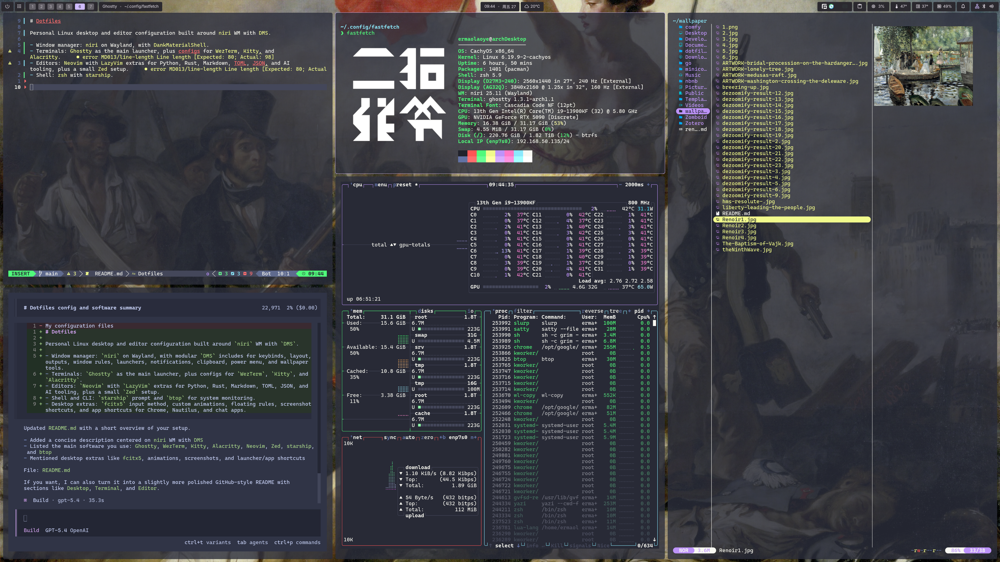

# Dotfiles

Personal Linux desktop and editor configuration built around `niri` WM with `DMS`.

- Window manager: `niri` on Wayland, with modular `DMS` includes for keybinds, layout, outputs, window rules, launchers, notifications, clipboard, power menu, and wallpaper tools.
- Terminals: `Ghostty` as the main launcher, plus configs for `WezTerm`, `Kitty`, and `Alacritty`.
- Editors: `Neovim` with `LazyVim` extras for Python, Rust, Markdown, TOML, JSON, and AI tooling, plus a small `Zed` setup.
- Shell and CLI: `starship` prompt and `btop` for system monitoring.
- Desktop extras: `fcitx5` input method, custom animations, floating rules, screenshot shortcuts, and app shortcuts for Chrome, Nautilus, and chat apps.

